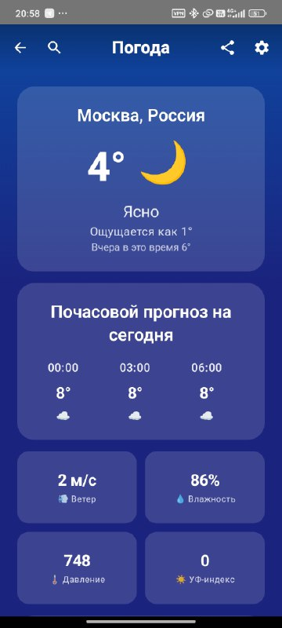
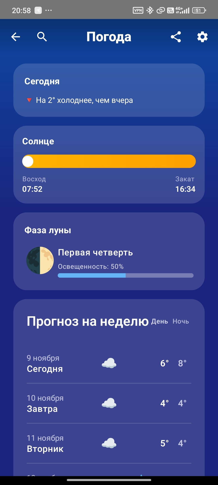
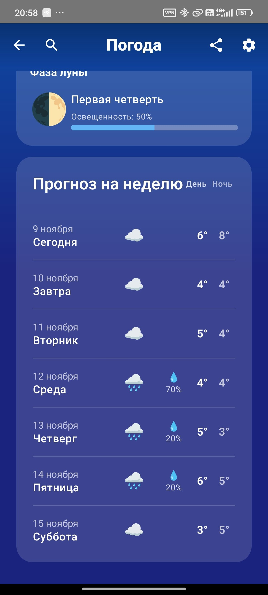

# Weather

*Elegant weather app with accurate forecasts and beautiful interface*

[Features](#-features) • [Screenshots](#-screenshots) • [Download](https://github.com/Maloy-Android/Weather/releases) • [Development](https://github.com/Maloy-Android/Weather/pulls)

## ✨ Features

### 🎨 User Interface
- **GRADIENT** - gradient background colors when weather state
- **Dark & light themes** - automatic adaptation
- **Intuitive gestures** - swipe to refresh and navigate
- **Notifications** - see weather on lock screen

### 🌡️ Weather Data
- **Accurate forecasts** - data from Yandex Weather API
- **Hourly forecast** - detailed 24-hour information
- **7-day outlook** - long-term planning
- **Detailed metrics** - humidity, pressure, wind, UV index
- **Geolocation** - automatic location detection
- **Moon Phase** - current moon stage with visual representation

### 🚀 Technologies
- **Kotlin & Coroutines** - modern asynchronous programming
- **Jetpack Compose** - declarative UI toolkit
- **Clean Architecture** - clean and scalable codebase
- **Yandex Weather API** - reliable weather data

## 📸 Screenshots

  <h2>📱 Weather App Screenshots</h2>
  
  

    
    
    
    
    
  

  
   

